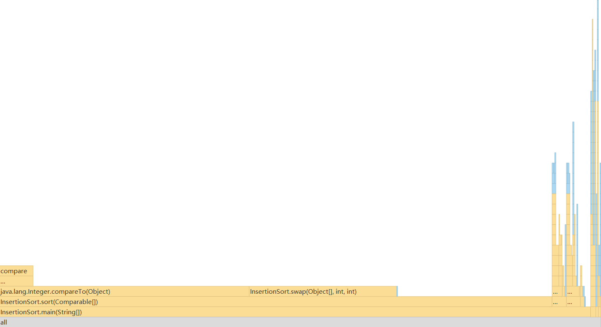

# 使用Profile工具对插入排序进行效能分析

*李文豪 41911115 计科*

***

## 插入排序

### 插入排序简介

插入排序是指在待排序的元素中，假设前面n-1(其中n>=2)
个数已经是排好顺序的，现将第n个数插到前面已经排好的序列中，然后找到合适自己的位置，使得插入第n个数的这个序列也是排好顺序的。按照此法对所有元素进行插入，直到整个序列排为有序的过程，称为插入排序。
> 简单来说，就是之前的已经排好了，又来了一个找合适的地方放进去就OK。
***

### 代码完成

* 生成有n个元素的随机数组,每个元素的随机范围为[rangeL, rangeR]

```java
    public static Integer[]generateRandomArray(int n,int rangeL,int rangeR){

        assert rangeL<=rangeR;

        Integer[]arr=new Integer[n];

        for(int i=0;i<n; i++)
        arr[i]=new Integer((int)(Math.random()*(rangeR-rangeL+1)+rangeL));
        return arr;

        }
```

* 将数组中的两元素交换顺序

```java
    private static void swap(Object[]arr,int i,int j){
        Object t=arr[i];
        arr[i]=arr[j];
        arr[j]=t;
        }
```

* 插入排序核心代码

```java
    public static void sort(Comparable[]arr){

        int n=arr.length;
        for(int i=0;i<n; i++){
        // 寻找元素 arr[i] 合适的插入位置
        for(int j=i;j>0;j--)
        if(arr[j].compareTo(arr[j-1])< 0)
        swap(arr,j,j-1);
        else
        break;
        }
        }
```

***

## 效能分析



## 参考文献

[百度百科](https://baike.baidu.com/item/%E6%8F%92%E5%85%A5%E6%8E%92%E5%BA%8F/7214992?fr=aladdin)

